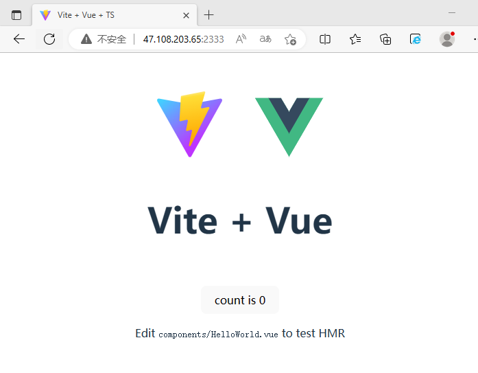
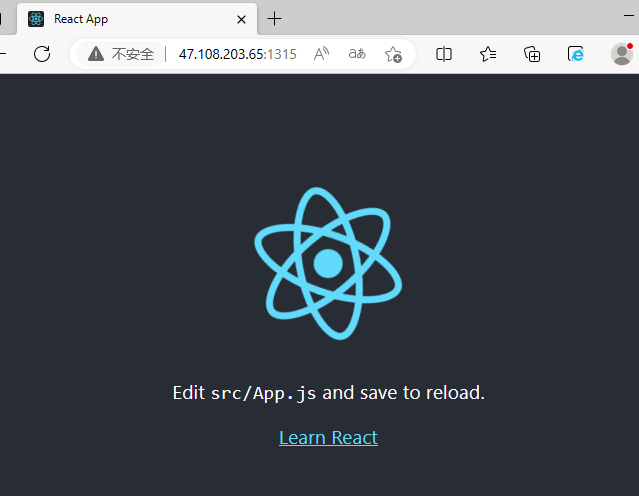

# fool-deploy

[](https://github.com/thomas-void0/fool-deploy/actions/workflows/test.yml)
[](https://github.com/thomas-void0/fool-deploy/actions/workflows/publish.yml) 

[English](./README.md)

你可以通过`fool-deploy`在服务器上快速且简单的部署你的博客，demo 页面等等。

# 示范

部署由 `vite` 和 `create-react-app` 创建的 app:




# 前置条件

1. 一台 linux 服务器.
2. 在你的服务器上[安装 docker 引擎](https://docs.docker.com/engine/install/centos/).

就是如此简单。

# 怎样使用

1. 安装依赖

```shell
$ npm i fool-deploy
```

2. 编辑你的 package.json, 添加以下命令:

```shell
"scripts": {
  "deploy":"fool"
}
```

3. 在你的项目根目录运行以下命令:

```shell
$ npm run deploy
```

# 配置

如果你想要自定义配置, 你需要在项目根目录下创建 `.foolrc` 文件.

```json
{
  "cache": true,
  "port": 2333,
  "packageCommand": "pnpm",
  "nodeVersion": "18.14-alpine",
  "nginxVersion": "1.22.1",
  "imageName": "fool-deploy:prod",
  "output": "dist"
}
```

|                      字段                      |           类型           |           描述           |      默认值       |
| :--------------------------------------------: | :----------------------: | :----------------------: | :---------------: |
|                     cache                      |         boolean          |       是否使用缓存       |       true        |
|                      port                      |          number          |      项目运行端口号      |       2333        |
|                 packageCommand                 | `yar` or `npm` or `pnpm` | 当前项目所使用的包管理器 |   终端执行输入    |
|  [nodeVersion](https://hub.docker.com/_/node)  |          string          | docker 镜像的 node 版本  |   18.14-alpine    |
| [nginxVersion](https://hub.docker.com/_/nginx) |          string          | docker 镜像的 nginx 版本 |      1.22.1       |
|                   imageName                    |          string          |    docker 镜像的名称     | package.json name |
|                     output                     |          string          |  项目的构建产物输出目录  |       dist        |

# 证书

[MIT](./LICENSE)
